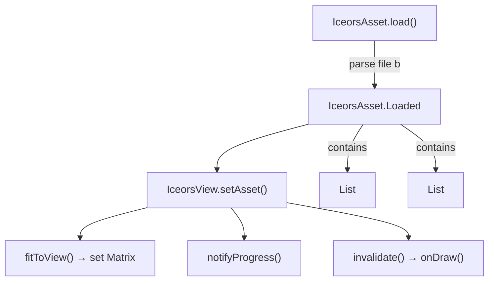
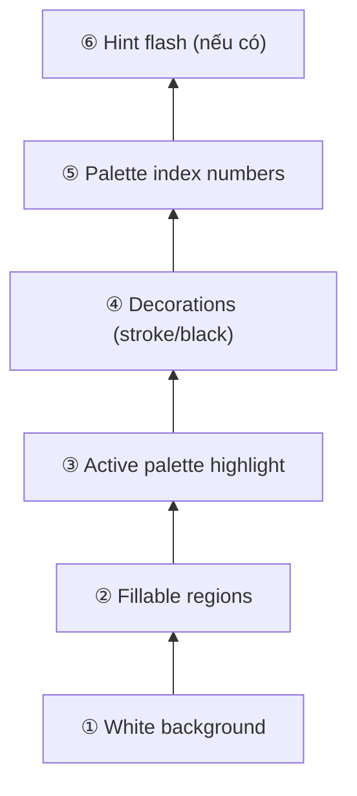
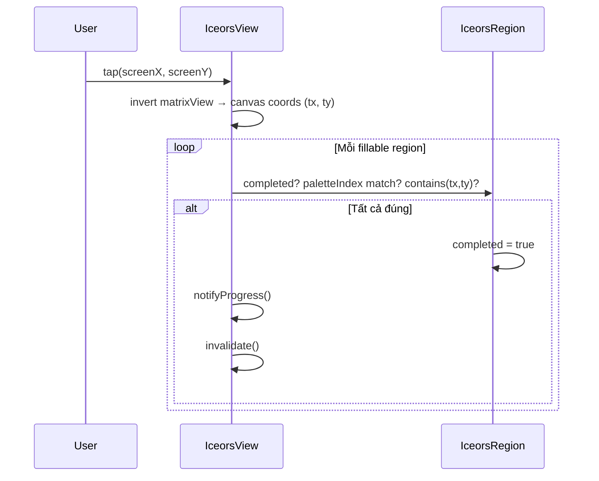
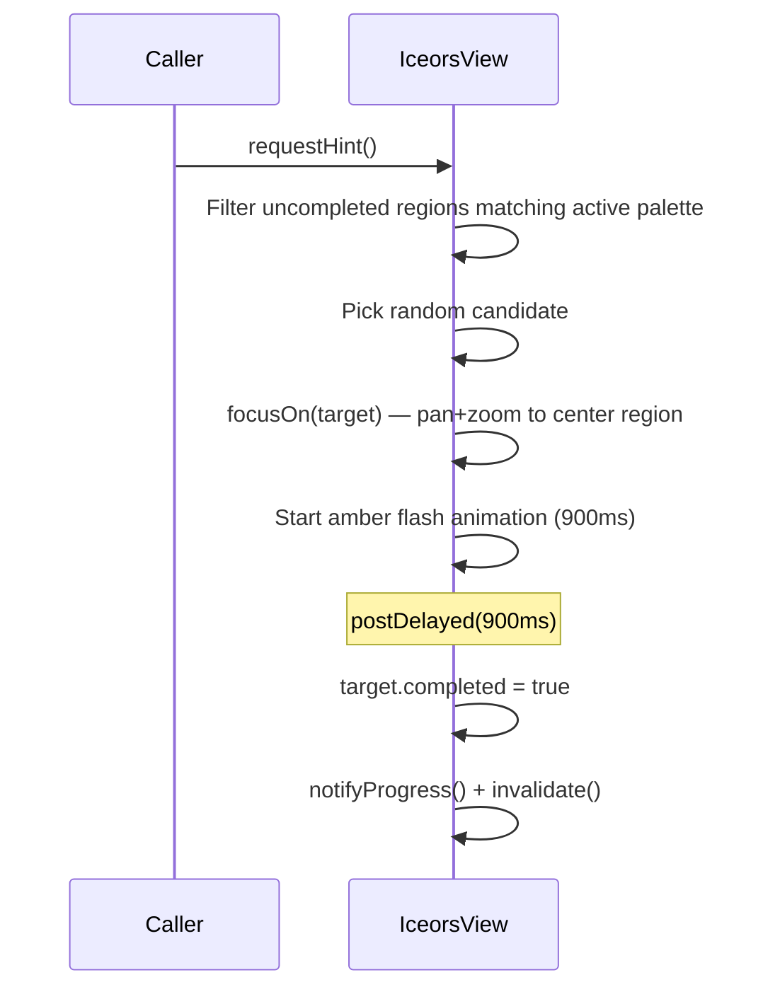
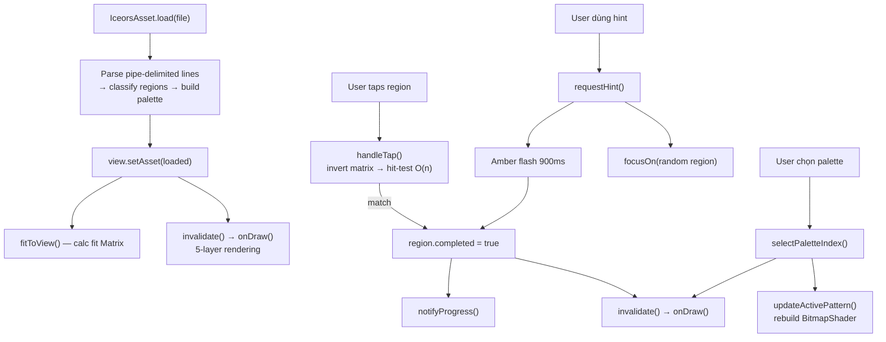

# Cơ chế hoạt động của `IceorsView.kt`

> [!NOTE]
> Đây là bản clone/mini-port của `DrawSurfaceViewNew` (tên gốc `E1/a.java`) từ APK Iceors Color-by-Number gốc. View này render một ảnh "tô màu theo số" dùng SVG paths.

---

## Kiến trúc tổng quan



---

## 1. Data Model — `IceorsRegion` & `IceorsAsset`

### File format (pipe-delimited)
```
svgPath | colorHex | strokeWidth | labelPosPacked | fontSize | [labelHex]
```

### Phân loại region ([IceorsRegion.Kind](file:///Users/macmini0051/Workspace/RE/ColorByNumber/app/src/main/java/com/apero/color/number/iceors/IceorsRegion.kt#L38))

| Điều kiện | Kind | Ý nghĩa |
|---|---|---|
| `color == white` & `strokeWidth == 0` | *(bỏ qua)* | Region vô dụng |
| `strokeWidth != 0` | `STROKE_LINE` | Đường viền trang trí |
| `(color & 0xFFFFFF) == 0` (đen) | `BLACK_FILL` | Tô đen trang trí |
| Còn lại | `FILLABLE` | Region user có thể tô |

### Palette
- Mỗi màu duy nhất trong các `FILLABLE` region → 1 **PaletteEntry** (index 1-based, theo thứ tự xuất hiện)
- Mỗi `IceorsRegion` fillable có `paletteIndex` trỏ tới bucket palette tương ứng

---

## 2. Rendering Pipeline — [onDraw()](file:///Users/macmini0051/Workspace/RE/ColorByNumber/app/src/main/java/com/apero/color/number/iceors/IceorsView.kt#L314-L391)

View vẽ theo **5 lớp** (từ dưới lên):



### Lớp ①: Nền trắng
```kotlin
canvas.drawColor(Color.WHITE)
```

### Lớp ②: Fillable regions
- Nếu `completed` → vẽ bằng **màu palette gốc**
- Nếu chưa `completed` → vẽ bằng **placeholder xám** (`#E6E6E6`)

### Lớp ③: Active palette highlight
- Chỉ vẽ lên các region **chưa completed** mà có `paletteIndex == activePaletteIndex`
- Dùng `BitmapShader` với `TileMode.REPEAT` → tạo pattern ô caro checker 4×4 px, màu 25% alpha của palette color
- Mục đích: **highlight** những ô user cần tô tiếp theo

### Lớp ④: Decorations
- `STROKE_LINE` → vẽ đường viền đen với `strokeWidth` từ data
- `BLACK_FILL` → tô đặc màu đen

### Lớp ⑤: Số palette
- Chỉ vẽ cho region **chưa completed**
- **Visibility gate**: `fontSize × zoom ≥ 12dp` → số chỉ hiện khi zoom đủ gần
- **Text size cố định**: luôn là `9dp` trên màn hình (không phụ thuộc kích thước region)
- Vị trí: `(labelX, labelY)` decode từ packed coordinate `y * canvasW + x`

### Lớp ⑥: Hint flash (tùy chọn)
- Amber pulse animation (sin wave 2 chu kỳ trong 900ms)
- Vẽ fill + stroke với alpha dao động

---

## 3. Transform & Zoom — [matrixView](file:///Users/macmini0051/Workspace/RE/ColorByNumber/app/src/main/java/com/apero/color/number/iceors/IceorsView.kt#L74)

Toàn bộ canvas sử dụng **1 Matrix duy nhất** `matrixView` cho cả pan + zoom:

```mermaid
flowchart LR
    FIT["fitToView()"] -->|"setScale + translate"| M["matrixView"]
    PINCH["ScaleGestureDetector"] -->|"postScale()"| M
    DRAG["GestureDetector.onScroll"| -->|"postTranslate()"| M
    M -->|"canvas.concat()"| DRAW["onDraw()"]
    M -->|"invert → mapPoints()"| TAP["handleTap()"]
```

### fitToView()
- Tính `fitScale = min(viewWidth / canvasSize, viewHeight / canvasSize)`
- Căn giữa canvas trong view
- Gọi khi `setAsset()` và `onSizeChanged()`

### Zoom constraints
- Min: `fitScale × 1.0` (không zoom out quá mức fit)
- Max: `fitScale × 8.0`

---

## 4. User Interaction

### Tap → Tô màu — [handleTap()](file:///Users/macmini0051/Workspace/RE/ColorByNumber/app/src/main/java/com/apero/color/number/iceors/IceorsView.kt#L276-L296)



**Hit-testing**: Duyệt O(n) qua tất cả fillable regions:
1. Skip nếu `completed`
2. Skip nếu `paletteIndex != activePaletteIndex`
3. Kiểm tra `bounds.contains()` (fast reject bằng RectF)
4. Kiểm tra `Region.contains()` (pixel-accurate theo path)

> [!TIP]
> App gốc dùng **index bitmap** (O(1) lookup bằng `(-2) - getPixel(x,y)`) thay vì duyệt O(n). Đây là optimization tiềm năng cho tương lai.

### Pinch → Zoom
- `ScaleGestureDetector` → `matrixView.postScale()` quanh focus point
- Clamp trong `[fitScale × 1, fitScale × 8]`

### Drag → Pan
- `GestureDetector.onScroll` → `matrixView.postTranslate(-dx, -dy)`

---

## 5. Hint System — [requestHint()](file:///Users/macmini0051/Workspace/RE/ColorByNumber/app/src/main/java/com/apero/color/number/iceors/IceorsView.kt#L178-L196)



- `focusOn()`: Nếu zoom hiện tại < `fitScale × 2`, tự zoom in để region dễ thấy. Sau đó pan để region nằm giữa view.

---

## 6. Progress Tracking — [notifyProgress()](file:///Users/macmini0051/Workspace/RE/ColorByNumber/app/src/main/java/com/apero/color/number/iceors/IceorsView.kt#L298-L312)

Hai callback:

| Callback | Data | Mô tả |
|---|---|---|
| `onProgressChanged` | `(completed, total)` | Tổng số region đã tô / tổng |
| `onPaletteProgressChanged` | `Map<Int, IntArray>` | Per-palette: `[done, total]` cho mỗi bucket |

---

## 7. Tóm tắt luồng chính


